# Evidencias (plantilla)

Incluye aquí (capturas o logs) con fecha:

## 1) NameNode UI (9870)
- Captura con DataNodes vivos y capacidad

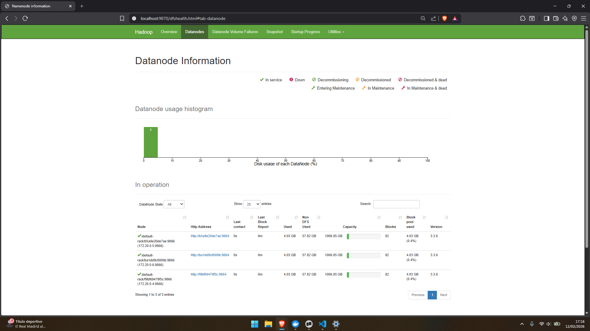

## 2) Auditoría fsck
- Enlace/captura de salida (bloques/locations)
- Resumen (CORRUPT/MISSING/UNDER_REPLICATED)

#### Location .jsonl 
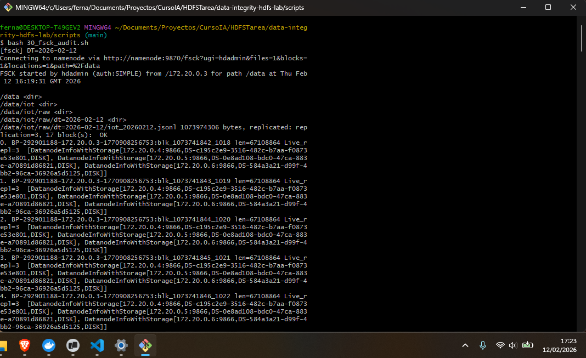

### Location .log
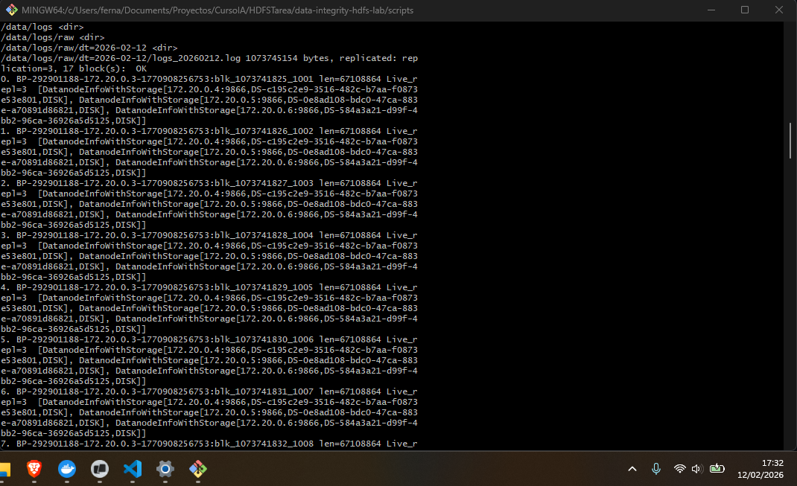

### Bloques
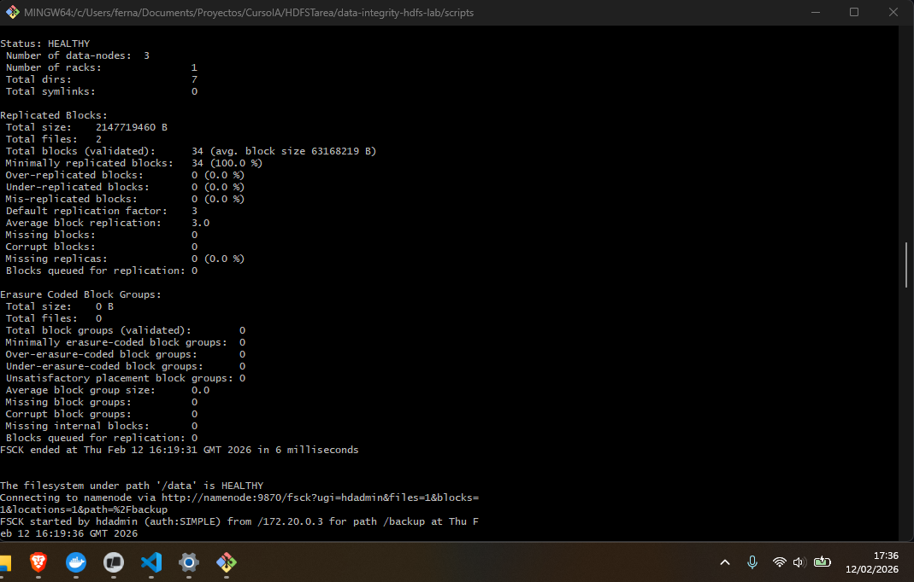

### Directorio de auditoria de fsck
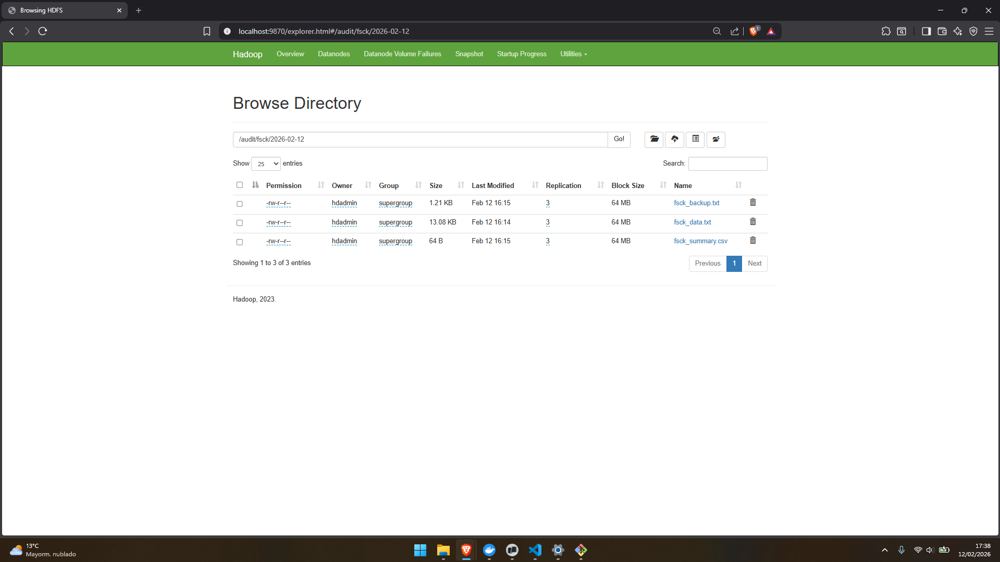

## 3) Backup + validación
- Inventario origen vs destino
- Evidencias de consistencia (tamaños/rutas)

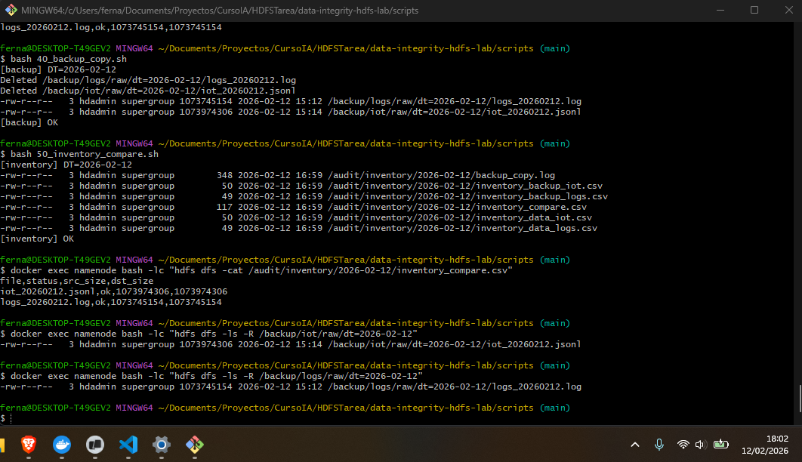

## 4) Incidente + recuperación
- Qué hiciste, cuándo y qué efecto tuvo
- Evidencia de detección y de recuperación

### Ejecucion del incidente
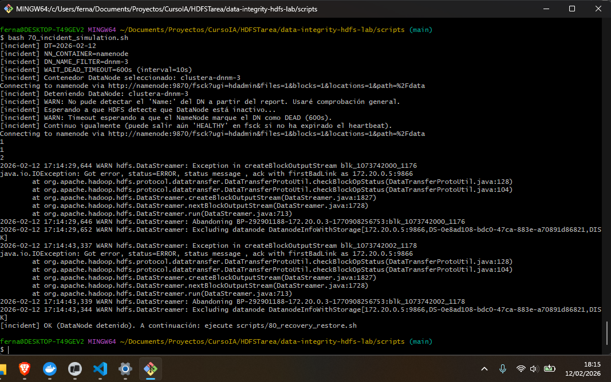

### Muestra del datanode caido
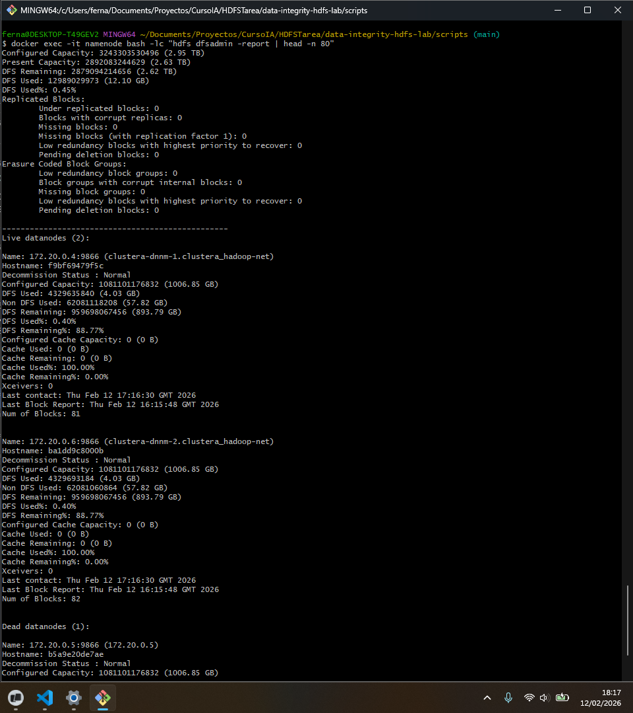
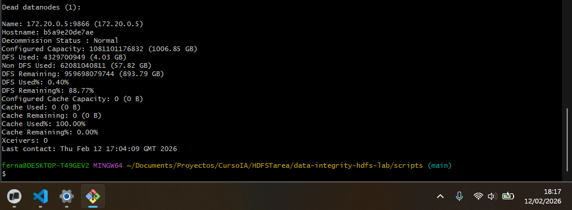

### Recuperacion del datanode
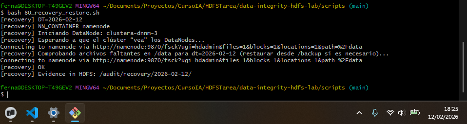

### Muestra de los datanodes en funcionamiento
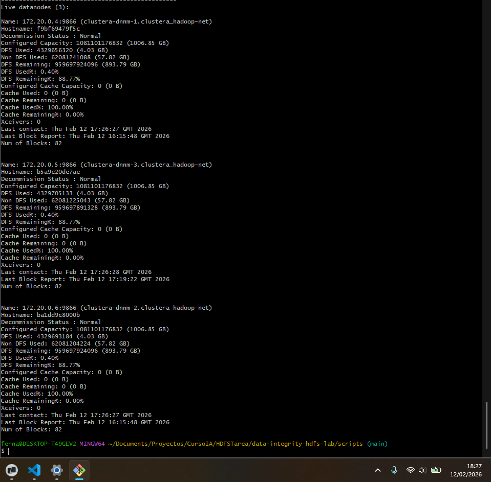

## 5) Métricas
- Capturas de docker stats durante replicación/copia
- Tabla de tiempos

### Estado normal
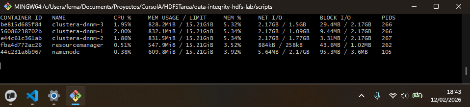

### Estado en proceso de copiado
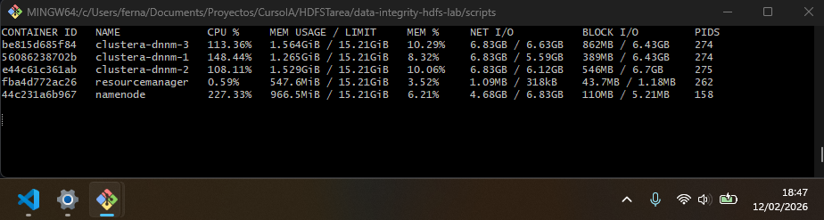
